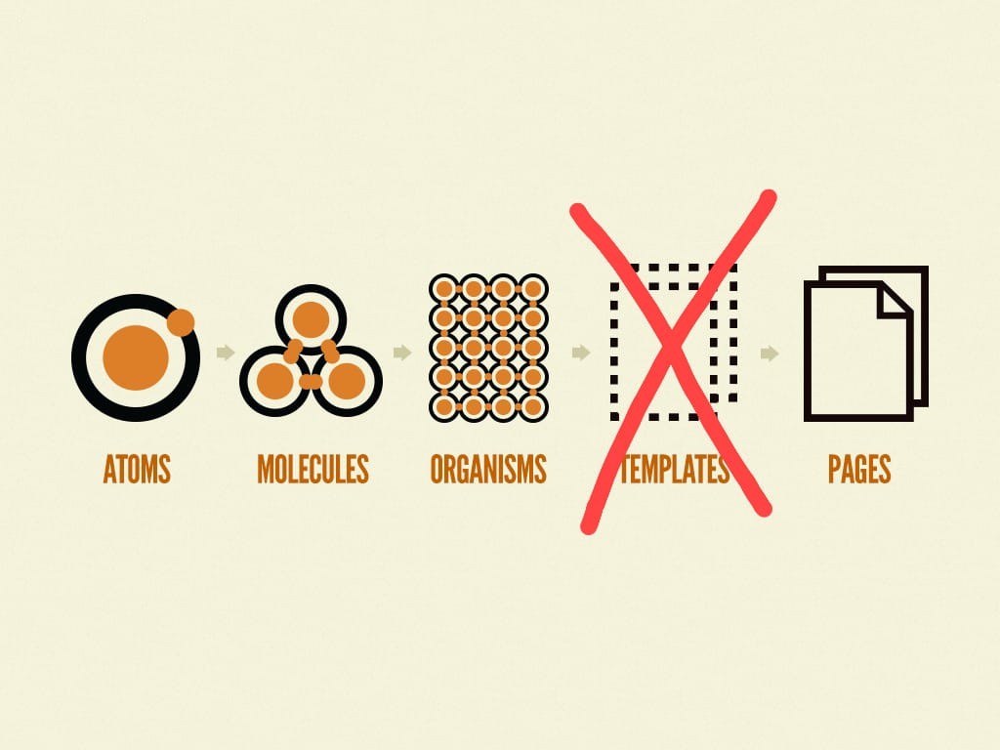

<h2> About the project 📋</h2>

 
    The architecture used at this project is based on Atomic Design, but I decided don't use the template approach. And why?
    I dont't like the idea of abstract the page structure added one more 'layer', the complexity increases unnecessarily.

<h2> Others infos </h2>
<lu style="list-styles:none;">
  <li>The server go run in http://localhost:3000.</li>
  <li>For install all dependecies run <code>yarn</code> in terminal.</li>
  <li>The user and password is "admin".</li>
</lu>
   
<b>Created by Chaos Code 👾</b>
